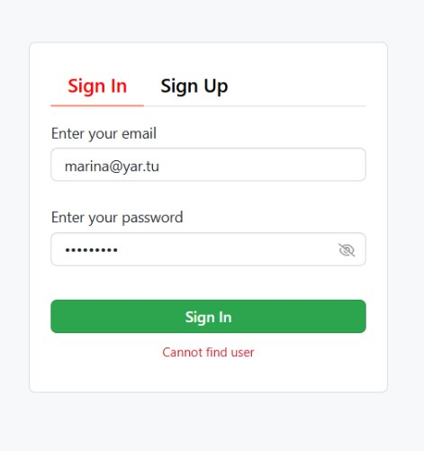
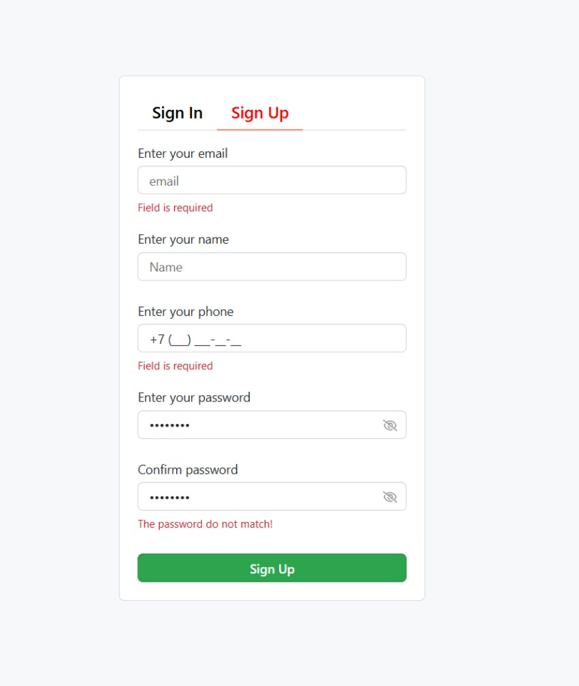

# 💸 SpendMoney
Интерактивное одностраничное приложение, вдохновлённое neal.fun/spend, с расширенным функционалом: регистрация, авторизация, корзина и симуляция крупных трат.

## ✨ Особенности
- 🧮 Реалистичная анимация трат с использованием react-spring/web
- 🛒 Корзина — контроль выбранных товаров
- 🔐 Авторизация и регистрация с хранением пользователей
- 🧾 Маска для ввода номера телефона
- ❗️Вывод ошибок при регистрации (валидация форм)
- 👁 Просмотр пароля по кнопке
- 🔁 Повторный ввод пароля с live-проверкой (watch)
- 🌐 Локальный сервер с хранением пользователей (json-server-auth)

## 🧱 Технологии
- React + Redux Toolkit
- React Router
- React Hook Form
- Axios
- LocalStorage
- json-server-auth, json-server для mock-бэкенда
- 

## 🚀 Быстрый старт

### Установка и запуск
```bash
# 1. Клонируйте репозиторий
git clone https://github.com/Marina4427/spendMoney.git

# 2. Установите зависимости
npm install

# 3. Запустите dev-сервер
npm run dev

После этого проект будет доступен по адресу: http://localhost:3000.
```

## 📸 Скриншоты




